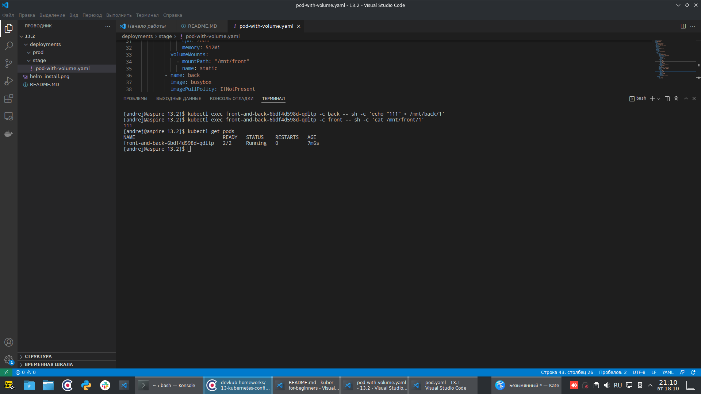
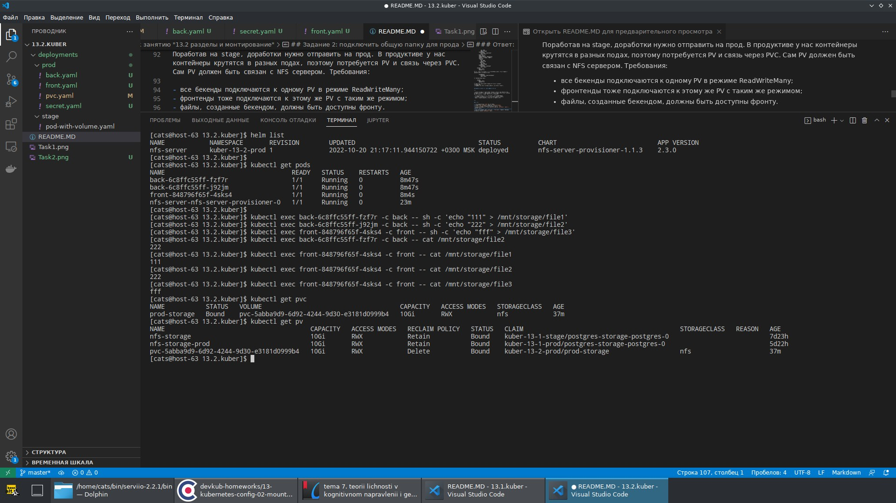

# Домашнее задание к занятию "13.2 разделы и монтирование"

## Задание 1: подключить для тестового конфига общую папку

---

В stage окружении часто возникает необходимость отдавать статику бекенда сразу фронтом. Проще всего сделать это через общую папку. Требования:

в поде подключена общая папка между контейнерами (например, /static);
после записи чего-либо в контейнере с беком файлы можно получить из контейнера с фронтом.

---
### Ответ:

1. Сделал новый `namespace`, назвал его `kuber-13-2-stage`
2. Сделал такой `deployment`:
```
apiVersion: apps/v1
kind: Deployment
metadata:
  labels:
    app: front-and-back
  name: front-and-back
  namespace: kuber-13-2-stage
spec:
  replicas: 1
  selector:
    matchLabels:
      app: front-and-back
  template:
    metadata:
      labels:
        app: front-and-back
    spec:
      containers:
        - name: front
          image: nginx:latest
          imagePullPolicy: IfNotPresent
          ports: 
            - containerPort: 80
              name: web
              protocol: TCP
          resources:
            limits:
              cpu: 500m
              memory: 1Gi
            requests:
              cpu: 200m
              memory: 512Mi
          volumeMounts:
            - mountPath: "/mnt/front"
              name: static
        - name: back
          image: busybox
          imagePullPolicy: IfNotPresent
          command: [ "sleep", "5000" ]
          resources:
            limits:
              cpu: 500m
              memory: 1Gi
            requests:
              cpu: 200m
              memory: 512Mi
          volumeMounts:
            - mountPath: "/mnt/back"
              name: static
      volumes:
        - name: static
          emptyDir: {}
```
То есть, взял тот же самый, что и в предыдущей работе, только добавил в описание каждого контейнера такое:
```
          volumeMounts:
            - mountPath: "/mnt/front(back)"
              name: static
```
и в описание пода такое:
```
      volumes:
        - name: static
          emptyDir: {}
```
И стала у них общая на под хранилка. Вот так оно работает:

Под запущен, из одного контейнера пишется, из другого читается.


## Задание 2: подключить общую папку для прода

---

Поработав на stage, доработки нужно отправить на прод. В продуктиве у нас контейнеры крутятся в разных подах, поэтому потребуется PV и связь через PVC. Сам PV должен быть связан с NFS сервером. Требования:

- все бекенды подключаются к одному PV в режиме ReadWriteMany;
- фронтенды тоже подключаются к этому же PV с таким же режимом;
- файлы, созданные бекендом, должны быть доступны фронту.


---

### Ответ:

1. Для начала поставил `helm` по инструкции.
2. Создал новый `namespace`, назвал его `kuber-13-2-prod`
3. В этом `namespace` установил nfs-server с помощью `helm`
4. Сделал по образцу, который был дан при установки `nfs-server` `helm'ом`. Получился такой:
```yaml
kind: PersistentVolumeClaim
apiVersion: v1
metadata:
  name: prod-storage
  namespace: kuber-13-2-prod
spec:
  storageClassName: "nfs"
  accessModes:
  - ReadWriteMany
  resources:
    requests:
      storage: 10Gi
```
5. Взял из предыдущей работы `back.yaml`, `front,yaml`, добавил в описание контейнера в каждый `deployment` такое:
```yaml
          volumeMounts:
          - name: storage
            mountPath: /mnt/storage  
```
и в описание пода добавил такое:
```yaml
      volumes:
      - name: storage
        persistentVolumeClaim:
          claimName: prod-storage 
```
Получилось в итоге вот что:

<details>
    <summary>back.yaml</summary>
    
  ```yaml
apiVersion: apps/v1
kind: Deployment
metadata:
  labels:
    app: back
  name: back
  namespace: kuber-13-2-prod
spec:
  replicas: 2
  selector:
    matchLabels:
      app: back
  template:
    metadata:
      labels:
        app: back
    spec:
      containers:
        - name: back
          image: busybox
          imagePullPolicy: IfNotPresent
          command: [ "sleep", "5000" ]
          resources:
            limits:
              cpu: 500m
              memory: 1Gi
            requests:
              cpu: 200m
              memory: 512Mi
          volumeMounts:
          - name: storage
            mountPath: /mnt/storage   
          env:
            - name: SECURE_POSTGRES_PASSWORD
              valueFrom:
                secretKeyRef:
                  name: mysecret
                  key: POSTGRES_PASSWORD          
            - name: SECURE_POSTGRES_USER
              valueFrom:
                secretKeyRef:
                  name: mysecret
                  key: POSTGRES_USER
            - name: SECURE_POSTGRES_PORT
              valueFrom:
                secretKeyRef:
                  name: mysecret
                  key: POSTGRES_PORT 
            - name: SECURE_POSTGRES_DBNAME
              valueFrom:
                secretKeyRef:
                  name: mysecret
                  key: POSTGRES_DBNAME
            - name: SECURE_POSTGRES_SERVICE_NAME
              valueFrom:
                secretKeyRef:
                  name: mysecret
                  key: POSTGRES_SERVICE_NAME                            
      volumes:
      - name: storage
        persistentVolumeClaim:
          claimName: prod-storage                                   
---
apiVersion: v1
kind: Service
metadata:
  name: back
  namespace: kuber-13-2-prod
spec:
  ports:
    - name: back
      port: 8080
      targetPort: 8080
  selector:
    app: back
  type: ClusterIP
  ```
</details>


<details>
    <summary>front.yaml</summary>
    
  ```yaml
apiVersion: apps/v1
kind: Deployment
metadata:
  labels:
    app: front
  name: front
  namespace: kuber-13-2-prod
spec:
  replicas: 1
  selector:
    matchLabels:
      app: front
  template:
    metadata:
      labels:
        app: front
    spec:
      containers:
        - name: front
          image: nginx:latest
          imagePullPolicy: IfNotPresent
          ports: 
            - containerPort: 80
              name: web
              protocol: TCP
          env:
            - name: back-url
              value: back
            - name: back-port
              value: "8080"
          resources:
            limits:
              cpu: 500m
              memory: 1Gi
            requests:
              cpu: 200m
              memory: 512Mi
          volumeMounts:
          - name: storage
            mountPath: /mnt/storage 
      volumes:
      - name: storage
        persistentVolumeClaim:
          claimName: prod-storage  
---
apiVersion: v1
kind: Service
metadata:
  name: nodeport
  namespace: kuber-13-2-prod
spec:
  ports:
    - name: front
      port: 80
      nodePort: 32181
      targetPort: 8080
  selector:
    app: front
  type: NodePort
  ```
</details>

<details>
    <summary>secret.yaml</summary>
    
  ```yaml
apiVersion: v1
kind: Secret
metadata:
  name: mysecret
type: Opaque
data:
  POSTGRES_PASSWORD: dGVzdHBhc3M=
  POSTGRES_USER: cG9zdGdyZXM=
  POSTGRES_PORT: NTQzMg==
  POSTGRES_DBNAME: cG9zdGdyZXM=
  POSTGRES_SERVICE_NAME: cG9zdGdyZXM=
  ```
</details>

И вот так это всё запущено:



Работют 2 back, один front, nfs-server. Из back'ов, из front в расшаренную папку на nfs сервере всё пишется и читается.
